# Getting Started

### Welcome and introduction 

Congratulations on beginning your journey with friendlyway Digital Signage. The friendlyway team welcomes you aboard and invites you to explore the world of digital communication and interaction at the points of service and work.

Our mission is unwavering: to assist you in curating unparalleled experiences, whether it's for your customers, visitors, employees, the general public, or any demographic your business resonates with.

friendlyway has combined its 25-year experience in the digital signage sector with more than five years of active development using cutting-edge technologies to create an efficient, extensive, and flexible software suite — friendlyway Cloud Platform. It has a wide range of applications, including digital signage displays, self-service stations, interactive information kiosks, visitor management solutions, and more.

Digital signage stands as a cornerstone on our platform. It's a medium that, when wielded correctly, can be profoundly transformative. As you embark on this journey, our hope is not just for you to use the platform, but to truly relish the myriad possibilities it offers.

Let's get started!

We continuously improve the software, striving to create a modern, user- friendly product that allows customers without prior technical knowledge to successfully leverage digital media. The platform is developed in constant dialogue with users, and we highly appreciate your feedback and ideas.

* Do you have questions or need support?
* Have you faced a problem, or do you have suggestions for improvement?

Call our support service at +49 (0) 89 58 80 44 40 from 9:00 to 18:00 Or contact us by email at [software-support@friendlyway.com](mailto:software-support@friendlyway.com)

### What is friendlyway Cloud Platform? 

friendlyway Cloud Platform (the Platform) is a cloud-based software platform built on a microservice-oriented architecture that integrates both hardware and software components for digital signage, interactive presentations, and digitized point-of-service processes.

Content creation, as well as scheduling and monitoring playback on end devices, does not require installing additional software. To access the Platform, you only need a browser and an Internet/Intranet connection. friendlyway Player that reproduces the assigned content is installed on end devices. Synchronization with the cloud occurs automatically within a few seconds.

MAIN COMPONENTS OF FRIENDLYWAY CLOUD PLATFORM AND THEIR FUNCTIONS

Web-based application:

* Content creation in the online editor
* Controlling playback time on end devices
* Monitoring of devices and playback
* User and rights management

friendlyway Player:

* Content playback by schedule
* Synchronization of content with the cloud
* Hardware component monitoring and statistical analysis

### Get started with the Platform in three steps 

| 1 | 
Open your browser and log in to the web application at https://cloud.friendlyway.com/

See Chapter 4.

If you don't have access yet, email us at <a href="mailto:software-support@friendlyway.com">software-support@friendlyway.com</a>
 |
| - | -------------------------------------------------------------------------------------------------------------------------------------------------------------------------------------------------------------------------------------------------------- |
| 2 | Download friendlyway Player to the target device. See Chapter 5.                                                                                                                                                                                         |
| 3 | Register friendlyway Player with a Platform account.                                                                                                                                                                                                     |

Done!

Now you have everything you need to create and manage digital content on the devices your users interact with.

### The Platform web application 

#### Overview

You can access the Platform in a web browser by entering your email address and password at https://cloud.friendlyway.com/:

<figure><figcaption></figcaption></figure>

To get test access to the Platform, contact us at [software-support@friendlyway.com](mailto:software-support@friendlyway.com)

After successful log in, the home page of the web app, Dashboard with an overview of devices, is loaded:

<figure><figcaption></figcaption></figure>

On the left, you will find a menu with access to the main areas of the application (standard Platform modules). Depending on the selected area, the top panel displays the corresponding tabs with sub-areas.

* Devices: Management and monitoring of controlled end devices and peripherals.

| Dashboard     | A list of devices with their status and basic hardware parameters.                                             |
| ------------- | -------------------------------------------------------------------------------------------------------------- |
| Devices       | Registration of new devices and setting parameters.                                                            |
| Groups        | Organization of devices into groups.                                                                           |
| Notifications | Setting up email notifications to stay informed about device performance — errors, warnings, and info updates. |
| Proof of Play | Tracking of content displayed on devices.                                                                      |

* Content: Creation, editing, and publishing of different content types for end devices.

| ScreenFlows | Interactive multimedia content built from various media objects.                     |
| ----------- | ------------------------------------------------------------------------------------ |
| Playlists   | Playlists consisting of videos, images, PowerPoint presentations, and PDF documents. |
| ShowBoards  | Presentations divided into fixed areas.                                              |

* Schedule: Creation and publishing of schedules for displaying content on registered devices. Priority content contains any communications overriding scheduled content.
* Media: Storage and organization of multimedia files within a centralized library. Here you can upload various files to the cloud to use them in ScreenFlows, Playlists, and ShowBoards.
* Users: Creation and management of user accounts with different roles, licenses, and permission levels, providing customized access to the Platform components.
* Check-In: Automation of the check-in process for visitors and employees. Refer to the Visitor Management user guide.
* WayFinding: Provision of precise location services and navigation assistance through interactive maps.

The Platform can be expanded with additional custom modules on client request. For instance, a Room Booking module is available through integration with Microsoft 365.

#### Creating a new end device 

Before registering an end device in the cloud, you should create that device in the Platform. To do this, go to the Devices tab in the Devices area and click Create:

<figure>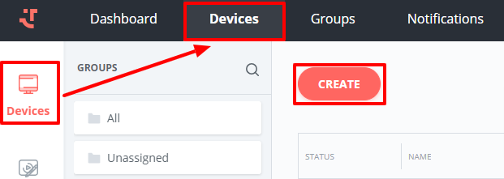<figcaption></figcaption></figure>

Fill in the required fields to complete the creation of a new device:

Device name: Enter a device name.

<figure><figcaption></figcaption></figure>

Description: Add a device description for easier identification (optional).

Group: Assign the device to a content group (optional).

Geolocation (Latitude and Longitude): geographic coordinates of the device location (optional).

Working time: You can specify the working hours of the device; at other times, the screen will be turned off (optional).

After entering all the data, confirm the creation of the device by clicking Save.

See Chapter 5 to learn how a PC running friendlyway Player connects to the Platform.

#### Content creation 

We developed our system to ensure you have a simple and easy way to create and publish various types of content. The main elements of our system, designed for content management, are the Content, Schedule, and Media modules. These control elements will be sufficient for you to create and publish your content according to a set schedule.

<figure><figcaption></figcaption></figure>

To create new content for your output device, go to the Content area. Here, you can find tools for creating various presentation options for content on different types of devices (kiosks, monitors, digital boards, etc.). The main elements are:

* ScreenFlow — enables complex interactive projects with different media objects and screen layouts. It supports a variety of content types, including images, videos, and text, and offers customizable display options.
* Playlist — allows you to set up simpler slideshows with images and videos on the screen, controlling the sequence and display time of elements and various transition options between them for a more dynamic presentation.
* ShowBoard — splits the screen into several fixed areas, allowing for the creation of engaging content across multiple displays, integrating various control elements for increased interactivity: video chat, links to external web pages, interactive wayfinding maps, etc.

**Creating a ScreenFlow**

To create a new ScreenFlow, go to the ScreenFlow tab in the Content menu and click Create.

<figure>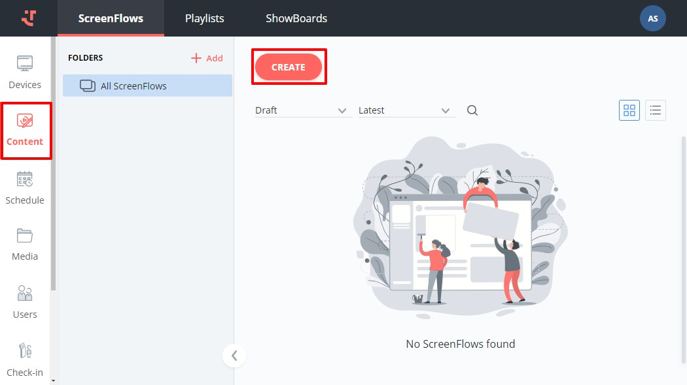<figcaption></figcaption></figure>

Fill in the necessary information, including:

Name: Provide a name for the ScreenFlow.

<figure>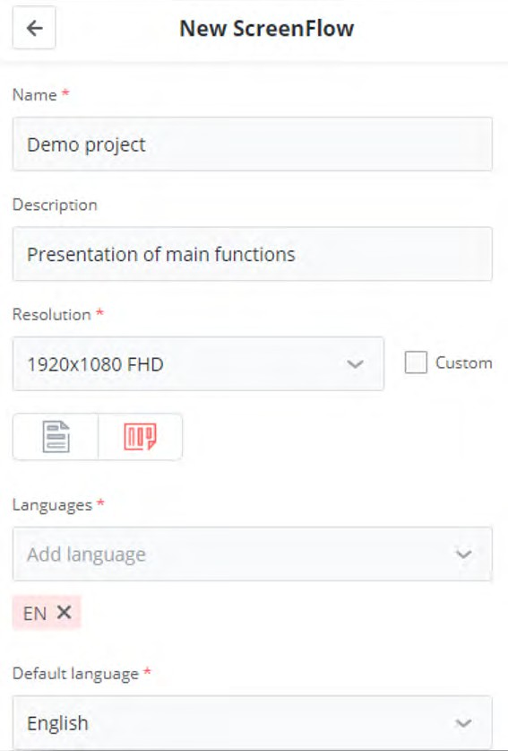<figcaption></figcaption></figure>

Description: Add a ScreenFlow description for easier content identification (optional).

Resolution: Resolution and orientation of the screen on which the ScreenFlow will be played. Select from the provided drop-down list of most common resolutions or enter custom values.

Choose between the portrait and landscape orientation by clicking the respective icon.

Languages: Choose from up to 15 languages to be supported by the ScreenFlow. If the language is of no importance, select any one from the list (e.g., English), which is also set as the default language.

After entering all the data, confirm the creation of a new ScreenFlow by clicking Save.

In the next step, you can define a default font and color theme for your ScreenFlow. By clicking on Color Palettes, you can choose one of the predefined color combinations for the main elements of the presentation:

<figure>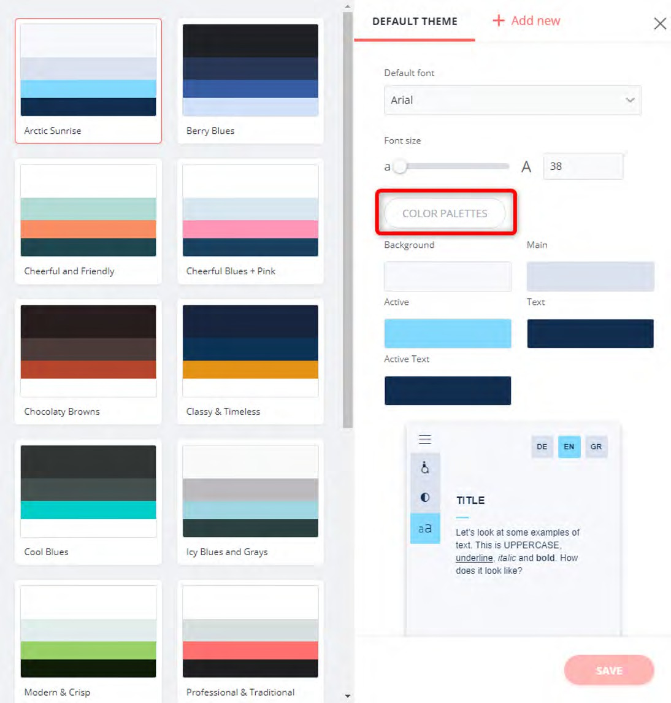<figcaption></figcaption></figure>

If necessary, you can define the color of each element manually by using a color palette. The changing colors are shown as a small preview:

<figure>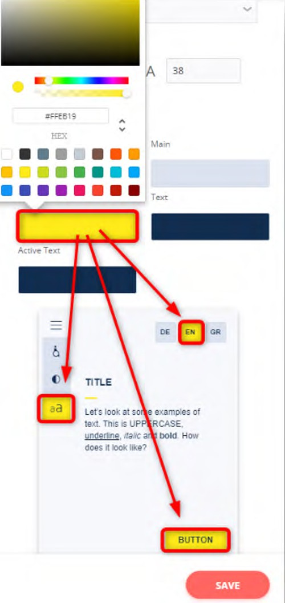<figcaption></figcaption></figure>

After choosing color themes and clicking Save, the online editor is loaded:

<figure>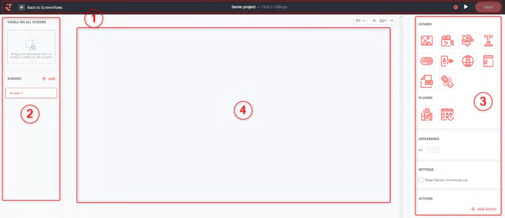<figcaption></figcaption></figure>

The title bar of the project includes:

1

|                | Button to exit the editor back to the ScreenFlows list.           |
| ----------------------------------------------------------------------------------------------------------------------------------------------- | ----------------------------------------------------------------- |
|  | The ScreenFlow name with resolution.                              |
|           | Displaying and editing of color settings (themes) of the project. |
|                                                                                                                                                 | Presentation preview.                                             |
| .png>)                                                                                                          | Save the ScreenFlow.                                              |
|     | Publish the ScreenFlow.                                           |

Navigation area for the presentation. The structure of the ScreenFlow open in the editor is displayed here.

2

An editor toolbar showing the media objects that can be inserted into the presentation and the selected object’s properties.

3

* Generic: standard elements for inserting.

<table data-header-hidden><thead><tr><th width="223"></th><th></th><th></th></tr></thead><tbody><tr><td>
Image

</td><td> Button</td><td> PDF Reader</td></tr><tr><td> Video</td><td> Ticker (scrolling text)</td><td> Web Object</td></tr><tr><td>
Carousel

</td><td>
Languages

</td><td>
Keyboard

</td></tr><tr><td>
Text

</td><td>
Menu

</td><td> Shape</td></tr></tbody></table>

* Plugins: elements that can be added to the Platform upon request.

<table data-header-hidden><thead><tr><th width="135"></th><th width="113"></th><th></th><th></th></tr></thead><tbody><tr><td></td><td>WayFinding</td><td></td><td>Call</td></tr><tr><td></td><td>Room Booking</td><td></td><td>Company Directory</td></tr></tbody></table>

|                                                                         |            |                                                                                                                                                |                 |
| ----------------------------------------------------------------------- | ---------- | ---------------------------------------------------------------------------------------------------------------------------------------------- | --------------- |
|                                                                         |            |                                                                                                                                                |                 |
|  | RSS Feed   |                                                                         | Department List |
|  | Visit List |  | AI Assistant    |

Editor workspace. Represents the surface of the target display.

4

To add a media object to your presentation, drag the necessary object to the workspace:

<figure><figcaption></figcaption></figure>

After inserting an object into the workspace, its properties are displayed on the right side of the editor. Here is an example of properties for the Text object:

General: Object placement settings (W - width; H - height; X-Y: coordinates of the upper left corner of the object).

<figure><figcaption></figcaption></figure>

Text: Font type and size, text position and color, and line spacing.

Text Value: Displayed text and its formatting (bold, italic, underlined).

Actions: An action when touching an object (none, go to a specific screen, move by the display, change the color theme, open an application).

In the same way, you can insert and set other objects on the first screen.

To add another screen to the presentation, click the + sign in the navigation area:

<figure><figcaption></figcaption></figure>

To insert an image into the ScreenFlow, the desired image must first be uploaded to the gallery. This can be done through the Media area of the Platform or directly in the ScreenFlow using the “Choose image from gallery” button:

<figure><figcaption></figcaption></figure>

After inserting an image into the second screen, the ScreenFlow structure will look like this:

<figure><figcaption></figcaption></figure>

When the screen is maximized, the inserted media objects are displayed. When you click on three dots of the screen and the object, a context menu opens:

* Rename: Rename a screen or a media object.
* Copy element ID: Copy only the ID of a screen or a media object.
* Copy: Copy a screen or a media object itself.
* Delete: Delete a screen or a media object.

You can quickly change the ScreenFlow structure and make it more understandable:

<figure><figcaption></figcaption></figure>

When you click on a screen in the presentation structure, the screen properties are displayed on the right side. In the Actions area, you can define the transition between screens. Click Add Action and expand its settings:

<figure><figcaption></figcaption></figure>

From the Screen drop-down list, select the name of the screen you want to display after a certain trigger (e.g., timeout) and specify the duration of the Delay. The animation (fading or sliding in different directions) is set in the Transition Effects field.

This action parameter should be set separately for each slide if there are no other triggers for changing screens in the presentation.

You can check how the project will look on the target display at any time by clicking the Preview button .png>) .

To exit the presentation, click the Back to ScreenFlows button in the upper left corner. The presentation is automatically saved to the cloud.

Once the ScreenFlow has been created, and you have previewed and approved it, it must be published for displaying on end devices. To do this, click the three-dot menu of the needed ScreenFlow and select the Publish option:

<figure><figcaption></figcaption></figure>

**Building a Playlist**

To create a new Playlist, click Create in the Playlists tab of the Content menu:

<figure><figcaption></figcaption></figure>

Provide the necessary information in the input fields:

Name: Enter a name for the Playlist.

<figure><figcaption></figcaption></figure>

Description: Add a Playlist description for easier content identification (optional).

Playback Mode: Choose whether the items in the Playlist should be played sequentially in the defined (Normal) or random (Shuffle) order.

Transition Effect: Choose a transition effect to be applied as the default for the entire Playlist. Options include Fade, Slide Right, Slide Left, Slide Up, and Slide Down.

Transition Time: Set the duration in seconds of any transition effect selected above.

Display Type: Select how the Playlist items should be displayed on the screen: Stretch, Center, or Adjust.

Image Display Time: Set the default duration in seconds for newly added images in the Playlist. The display duration of videos and PowerPoint presentations is automatically taken from the object properties.

Background Color: Specify the background color for the Playlist area not occupied by the content of the Playlist items.

Audio: Configure the audio settings for the Playlist. Choose one or multiple MP3 files from the gallery that will be played sequentially

and cyclically as background sound or enter the URL of a Stream. Set the required volume and enable the “Fade audio in/out” option to smoothly fade the sound during playback.

Once you click Save, the system creates an empty Playlist with the defined settings. The next step is to populate it with items, such as images, videos, PowerPoint presentations, ScreenFlows, or other Playlists. To add media objects, click Add Item, select the desired items from the gallery, and confirm your choice by clicking the Insert button:

<figure><figcaption></figcaption></figure>

The inserted media objects are displayed as a list:

<figure><figcaption></figcaption></figure>

You can now manually edit standard settings for each object. The total display time of the Playlist is the sum of the display time of each item and transition effects.

To add another item to the Playlist, click Add Item. To remove an item from the playlist, click on the three-dot menu of that item on the list and select the Delete option:

<figure><figcaption></figcaption></figure>

You can change the order of items in the playlist at any time. To do this, drag the item in the list to the desired position while holding the mouse pointer on the line with the previous item:

<figure>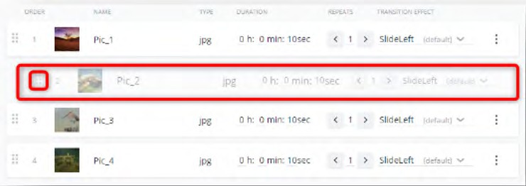<figcaption></figcaption></figure>

After entering all the data and media objects, you can preview the Playlist. Select a Device for the content to be previewed on from the drop-down list at the bottom right corner and click Preview.

All items in the Playlist are displayed in the specified order in the cycle. If the Shuffle option is activated in the Playlist settings, the media objects are displayed in random order.

Please note: MS PowerPoint must be installed on each output device to display PowerPoint presentations!

Once you have created, previewed, and approved the Playlist, you can publish it. To do this, click on the Publish icon in the Playlist editor or, if you are on the list of all Playlists, use the three-dot menu and select the Publish option:

<figure><figcaption></figcaption></figure>

**Composing a ShowBoard**

ShowBoard is a presentation in which the screen is divided into several fixed areas and filled with different content.

To create a new ShowBoard, go to the ShowBoards tab in the Content menu and click Create:

<figure>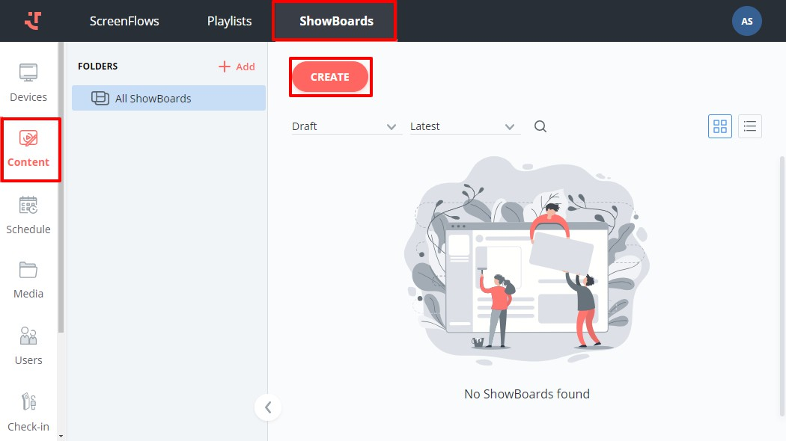<figcaption></figcaption></figure>

Fill in the necessary information in the provided fields:

Name: Enter the ShowBoard name.

<figure>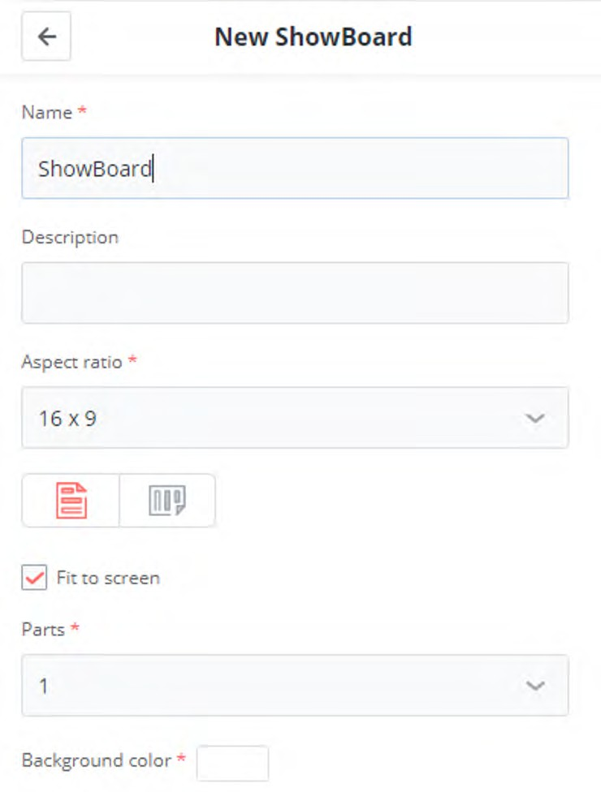<figcaption></figcaption></figure>

Description: Add the ShowBoard description for easier content identification (optional).

Aspect ratio: Select from the drop-down list of common aspect ratios and choose between the portrait and landscape orientations of the target display by clicking on the respective icon.

Fit to screen: Tick this option if you want to adapt the content to the target display with a different aspect ratio than the one selected above.

Parts: To divide the screen into multiple sections, select the number of areas and their configuration for the screen layout.

Background color: Choose the background color, which will be displayed in the areas not occupied by the ShowBoard items.

After filling in the values and clicking Save, the system creates a ShowBoard with the specified settings and displays its details on the right side. The workspace is divided into the selected number and configuration of areas. To enter a specific area, click the big plus sign in the center of it.

You can add more areas by clicking on the small plus signs at the borders of the selected area. If you don’t need an area, you can delete it by clicking on the bucket icon  in the upper right corner of the selected area.

To populate the ShowBoard with items, such as images, videos, web objects, created ScreenFlows, or created Playlists, click on the type of media object you want to insert into the selected area of the ShowBoard:

<figure>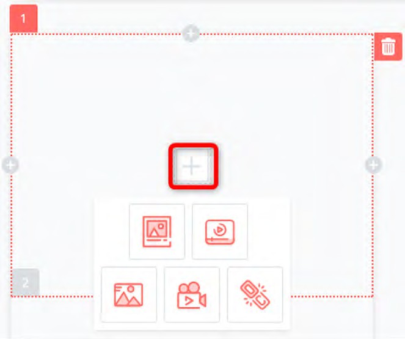<figcaption></figcaption></figure>

For each area, you can choose to Use Borders and adjust the width of the borders in the Content Display settings on the right side.

<figure>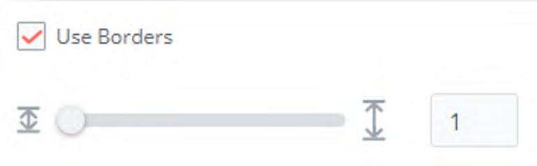<figcaption></figcaption></figure>

Once the ShowBoard is ready, you can publish it from the list of ShowBoards by clicking on the three-dot menu and selecting the Publish option:

<figure>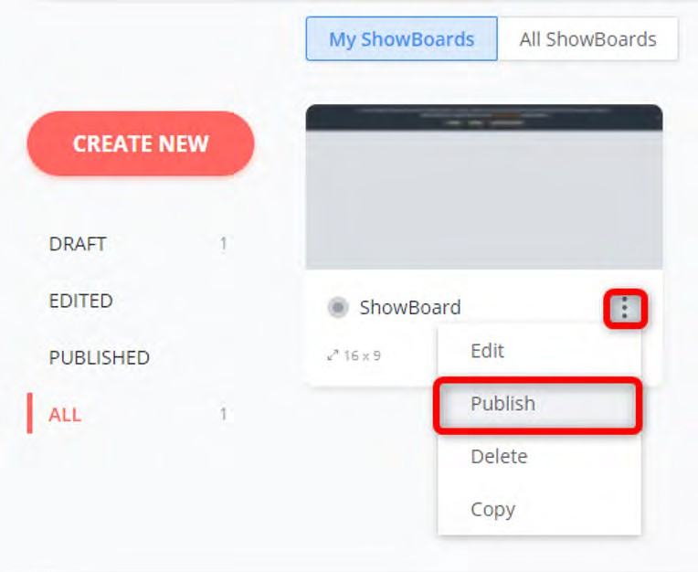<figcaption></figcaption></figure>

### friendlyway Player 

friendlyway Player is an application specifically designed to play scheduled media content on kiosks and displays. It ensures that content is displayed precisely according to predefined schedules, enhancing the user experience and maintaining consistent content delivery across all devices.

The player should be installed and configured once on each end device. In this tutorial, we will use friendlyway Player for Windows 10.

#### friendlyway Player installation

The setup file for friendlyway Player can be downloaded from the Platform. To do this, log into your account (see Chapter 4.1) and click on the friendlyway logo in the upper left corner:

Download and run the Windows setup file.

At the end of the installation, tick the box next to Launch FW Player and click Finish:

<figure>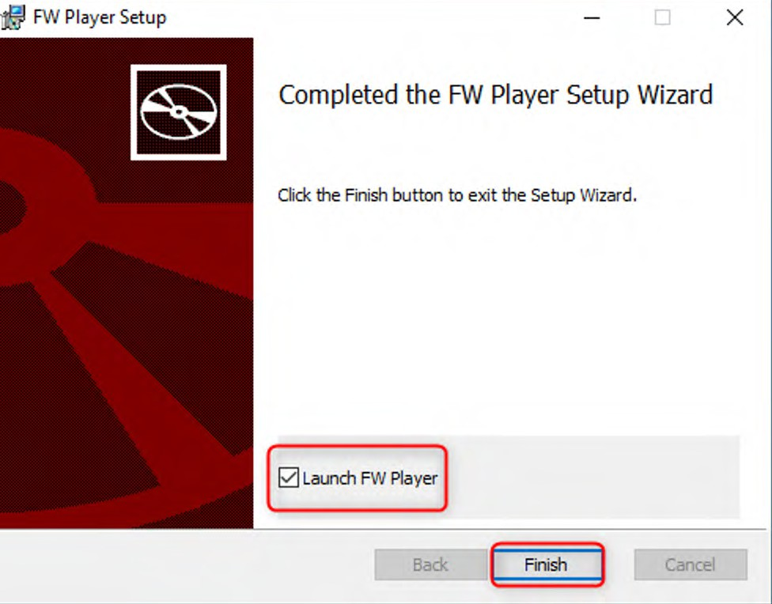<figcaption></figcaption></figure>

#### Player registration on the cloud server

After launching the newly installed player application, you will be prompted to enter an activation code:

<figure>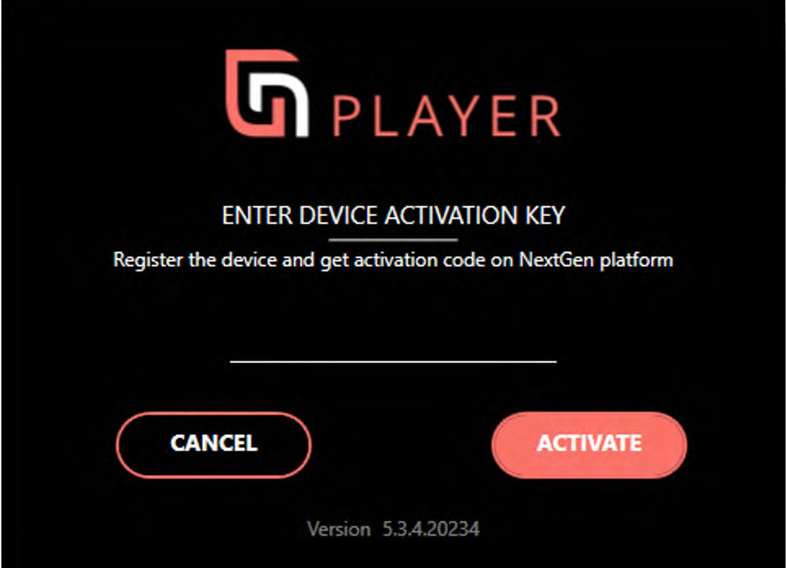<figcaption></figcaption></figure>

Go to the list of devices on the Platform in the Devices area and click on the entry that should be connected to the corresponding device. Then click Activate:

<figure>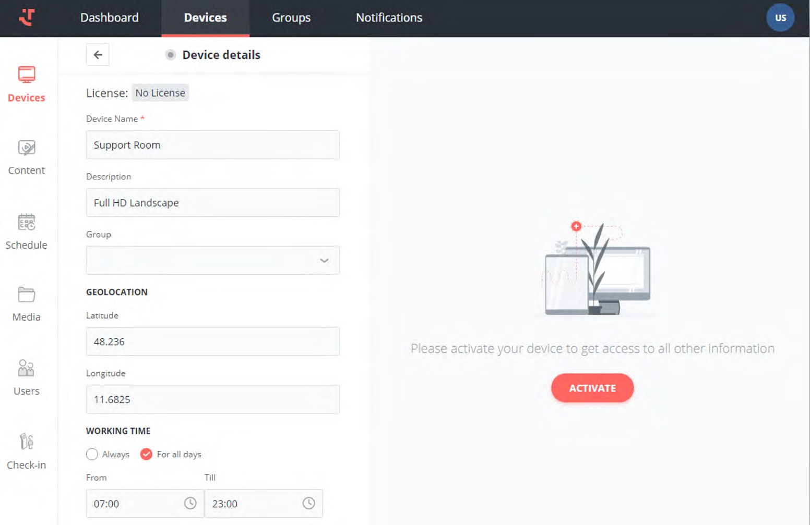<figcaption></figcaption></figure>

The code will be displayed. Copy the code into the activation window of friendlyway Player and click Activate. Please note that the generated code must be entered within five minutes. Otherwise, you’ll need to create a new activation code.

After connecting friendlyway Player to the entry on the Platform, the program is synchronized with the server and all settings are loaded. The device is now displayed as "activated" and "online" in the device list.

#### friendlyway Player configuration

After successfully registering friendlyway Player on the Platform, the application is loaded:

<figure>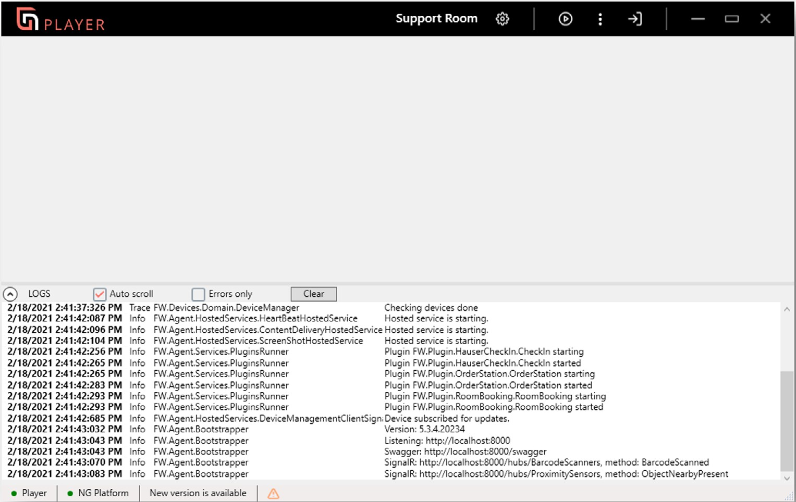<figcaption></figcaption></figure>

The top panel of the window contains the device name and icons with the main functions of the application:

|  | Opens application settings, see below.                                                                  |
| -------------------------------------------------------------------- | ------------------------------------------------------------------------------------------------------- |
|  | Starts playback of the assigned content.                                                                |
|  | Opens the application menu (Information, Updates, Logs).                                                |
| 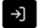 | Exit the application.                                                                                   |
|  | Minimizes or closes the application window while friendlyway Player continues to run in the background. |

You can also use the CTRL + P keyboard combination to start playback. Pressing this combination once starts playback in a smaller window; the next time you click the shortcut, the display will be maximized.

To stop playback, use the CTRL + S keyboard combination. Pressing this combination once shrinks the display to a smaller size; the next time you click the shortcut, the assigned content will stop displaying.

friendlyway Player settings are called by clicking the button  in the upper window panel:

<figure>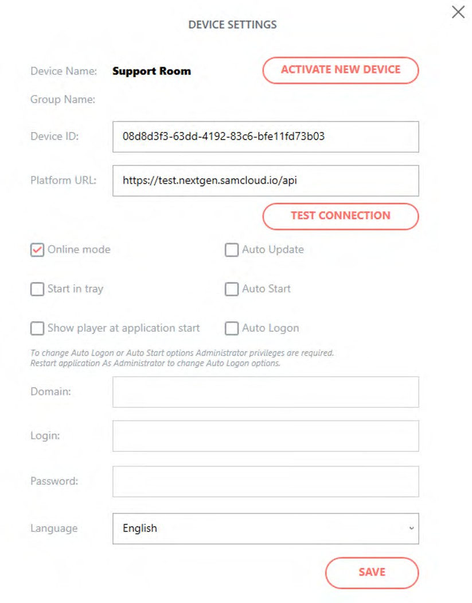<figcaption></figcaption></figure>

Device ID: A unique identifier used to identify a device in the system.

Platform URL: "/api" must be at the end of the Platform address.

Online mode: A connection to the Platform is established regularly to update content and settings from the server. If this parameter is disabled, content that was downloaded the last time you connected to the cloud is played.

Start in tray: If enabled, friendlyway Player launches minimized as an icon on the Windows taskbar.

Show player at application start: If enabled, content playback starts automatically when friendlyway Player is loaded. If this parameter is disabled, you should start playback manually using the CTRL + P keyboard shortcut or the corresponding button on the top panel of the player window.

Auto Update: Allow automatic software updates.

Auto Start: If enabled, friendlyway Player starts automatically when running an operating system.

Auto Logon: If enabled, the registered Windows user login credentials will be used at the system startup. The end user does not need to log in after restarting the computer. Here you need to enter the domain (if any), login, and password.

Please note: To change the Auto Start and Auto Logon options, you need to run friendlyway Player with administrator rights.

<figure>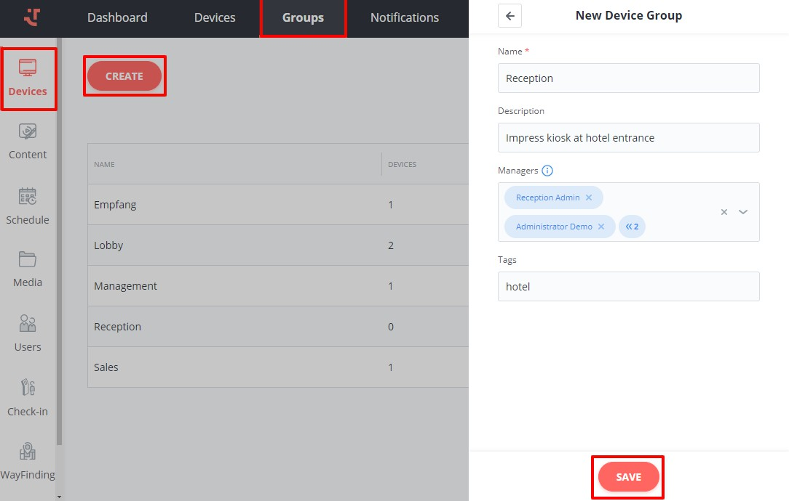<figcaption></figcaption></figure>

### Content assignment and transmission 

Content created in the online editor is assigned to device groups for playback. A group can contain one or more devices. For example, if a new ScreenFlow or an updated Playlist should be displayed on 15 output devices, it is assigned only once to the entire group.

The following steps are required to assign content to a device:

| 1 | Create and publish content. See Chapter 4.                     |
| - | -------------------------------------------------------------- |
| 2 | Add a device to a group. See 6.1 below.                        |
| 3 | Create and publish a content playback schedule. See 6.2 below. |

#### Creating a group of devices

In the Devices area, go to the Groups tab and click Create to add a new group:

Enter the group name and optional description, select users from the drop-down list who will manage the devices and schedules in this group, and add tags, if necessary. Confirm your entry by clicking Save. The new group is now displayed in the list of available groups.

To add a device to a group, you can specify the group when you create a device or change the assignment later with just a few clicks. To do this, click the corresponding device in the list of devices and select the required group from the drop-down list:

<figure>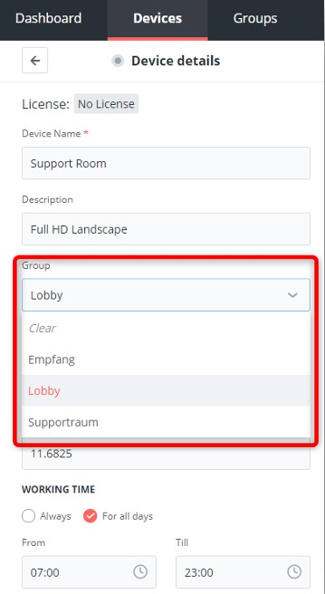<figcaption></figcaption></figure>

#### Schedule creation

Content in the group is played on schedule. Go to the Schedule section and select the group for which you want to schedule content to play. After you click on a day in the calendar, the Add Content button will become active:

<figure><figcaption></figcaption></figure>

An area with created ScreenFlows, Playlists, and ShowBoards is displayed upon clicking on Add Content:

<figure><figcaption></figcaption></figure>

You can switch between content types, filter content, or search by name. Once you have selected the desired presentation, click Next. In the next window, you can define a repeat pattern for playing content:

Period: The time interval during the day(s) in which the content should be played.

<figure><figcaption></figcaption></figure>

Repeat: Define the type of playback recurrence.

* Never — display only once
* Daily — repeat every (second, third, etc.) day
* Weekly — repeat every (second, third, etc.) week
* Monthly — repeat every (second, third, etc.) month
* Yearly — repeat every year

You can specify the From and End By dates for repeat playback, choose to run it Always, or end it after a certain number of occurrences.

Once the schedule is confirmed by clicking Save, the assigned content is displayed on the calendar:

<figure><figcaption></figcaption></figure>

To start playing content on the output device, you should publish the schedule. To do this, click the appropriate button:

<figure><figcaption></figcaption></figure>

If the content itself has not yet been published, you will be asked what exactly you want to publish:

<figure><figcaption></figcaption></figure>

After confirming your choice, you will receive a message that the schedule has been successfully published.

Playback starts on the target device.

Congratulations on your first published digital sign with friendlyway!

If you still have questions or need support, please feel free to call our support team on +49 (0) 89 58 80 44 40

or contact us by email at [software-support@friendlyway.com](mailto:software-support@friendlyway.com)
